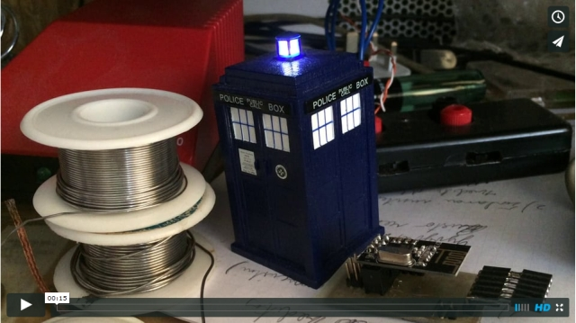
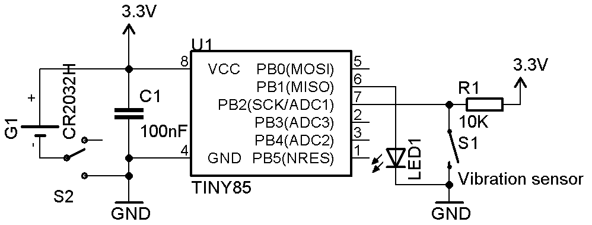

# TARDIS Pulsing Light

This is quick and simple TARDIS toy modification based on ATTiny85 uC and a SW-18020P vibration sensor. 

When microcontroller is powered on, it does 3 TARDIS light style pulses (slowly fades LED in and out) and then goes to POWER DOWN mode in which it consumes only ~0.1 uA. Vibration sensor is connected to INT0 and acts as a wake up source for microcontroller. After receiving a “shock” microcontroller wakes up, does 3 more light “pulses” and goes back to sleep. That’s all.

More info and photos can be found in my Lithuanian blog: http://paulius.bautrenas.lt/blog/?p=797
